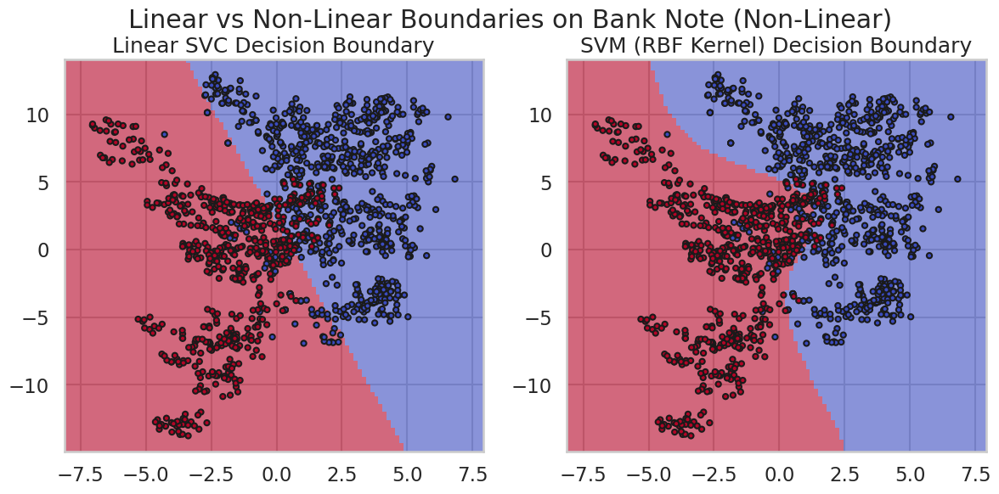
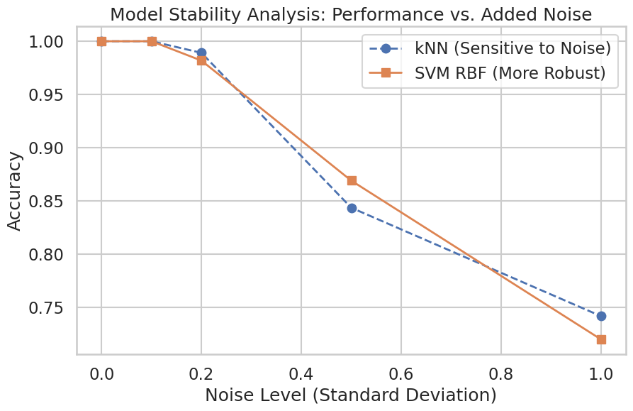

# Comprehensive Analysis of Classical Machine Learning Classifiers


## 📌 Overview
This repository contains a rigorous, master's-level experimental design and in-depth analysis of classical machine learning classifiers. The project evaluates multiple models across three distinct datasets, each carefully selected to present a unique challenge: high dimensionality, extreme noise/low features, and non-linear decision boundaries.

The goal is not merely to achieve high accuracy, but to critically analyze model behavior, bias-variance trade-offs, decision boundaries, and robustness to noise.

## 🗄️ Datasets Analyzed
1. **High-Dimensional Data:** [Human Activity Recognition (HAR)](https://archive.ics.uci.edu/ml/datasets/human+activity+recognition+using+smartphones)
   - *Challenge:* 561 features representing sensor signals.
   - *Focus:* Curse of dimensionality, impact of PCA on training time and accuracy.
2. **Noisy & Low-Feature Data:** [Pima Indians Diabetes](https://www.kaggle.com/datasets/uciml/pima-indians-diabetes-database)
   - *Challenge:* 8 features with significant class overlap and biological noise.
   - *Focus:* Preprocessing (imputing missing values/zeros), standardization sensitivity, and bias-variance analysis.
3. **Non-Linear Decision Boundary:** [Bank Note Authentication](https://archive.ics.uci.edu/ml/datasets/banknote+authentication)
   - *Challenge:* Complex, non-separable classes in a 2D feature space (using Variance and Skewness).
   - *Focus:* 2D decision boundary visualization, Linear vs. Non-linear models (e.g., SVM kernels).

## 🤖 Models Implemented & Tuned
- **k-Nearest Neighbors (kNN)** (Comparing multiple distance metrics)
- **Linear Classifiers** (Linear SVC / Perceptron)
- **Logistic Regression**
- **Support Vector Machines (SVM)** (Linear, RBF, and Poly kernels)
- **Decision Trees**
- **Naive Bayes** (Gaussian)
- **Multi-Layer Perceptron (MLP)** (Multiple architectures)

*All models were rigorously evaluated using Cross-Validation and Hyperparameter Tuning via GridSearchCV/RandomizedSearchCV.*

## 🔬 Key Experimental Analyses
- **Bias–Variance Trade-off:** Empirical evidence comparing Train vs. Test performances to identify overfitting/underfitting.
- **Learning Curves:** Visualizations to understand data efficiency and model capacity.
- **Decision Boundaries:** 2D contour mapping demonstrating how different kernels handle non-linear structures.
- **Noise Robustness:** Controlled injection of Gaussian noise to observe model degradation (e.g., kNN sensitivity vs. SVM robustness).
- **Dimensionality Reduction:** Evaluating the trade-off between retained variance and computational efficiency using PCA.


### 📊 Experimental Results & Visualizations

#### 1. Decision Boundaries (Bank Note Dataset)
<p align="center">
  
  <br>
  <em>Decision Boundaries showing how models separate non-linear data</em>
</p>


#### 2. Noise Robustness Analysis
<p align="center">
  
  <br>
  <em>Figure 2: Evaluating kNN vs. SVM performance under controlled noise.</em>
</p>


#### 3. MLP Learning Curves
<p align="center">
  
  <br>
  <em>Figure 3: Training and validation loss/accuracy over epochs.</em>
</p>


## 🚀 How to Run the Project

1. Clone the repository:
   ```
   git clone https://github.com/Erfan-Ghafari/ML-Classifiers-Analysis.git
   cd ML-Classifiers-Analysis
   ```


2. Install the required dependencies:
   ```
   pip install -r requirements.txt
   ```


3. Open the Jupyter Notebook:
   ```
   jupyter notebook Analysis_Classical_ML_Classifiers.ipynb
   ```
